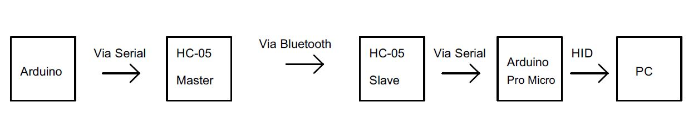

# promicro-hc05-gamepad
Gamepad Bluetooth

# Materiais
- Arduino Nano
- Arduino Pro Micro
- HC-05

# Como funciona
Controle (master):
-Arduino Nano (escolhi esse por ser pequeno e barato) se comunica com um HC-05 em modo master. 
-Botões são ligados nas entradas do Arduino. Cada um, ao ser pressionado, manda um caractere pelo TX do Arduino para o RX do HC-05.
-O HC-05 transmite esse sinal via bluetooth.

Dongle (slave):
-HC-05 em modo slave capta o sinal bluetooth e os transmite via pino TX.
-Arduino Pro Micro (escolhido por conta da compatibilidade HID) lê o sinal TX do HC-05 pelo pino RX.
-Cada caractere recebido via serial é convertido para um comando da biblioteca "Gamepad.h".

Ambos HC-05 foram configurados com Serial a 38400.

